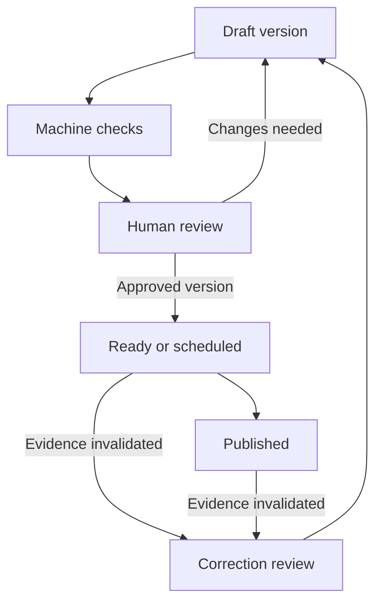

# PolarPramaan — SIH26063 research and Claude Code execution brief

Prepared for Yash Raj • Research checked: 25 September 2026

**Purpose:** Build a working polar knowledge repository and evidence-backed outreach platform, using real, attributable content, with the web application deployed on Vercel. This file contains competitive findings, ten differentiated features, technical contracts, and sequential Claude Code prompts. It is a build specification, not a claim that the application or a GitHub repository has already been created.

## 1. Decision

Build **PolarPramaan: From Polar Evidence to Public Understanding**.

The central workflow is:

1. Bring a real report, dataset, publication, photograph, video or institutional activity into a curated catalog.
2. Preserve source identity, rights, date, version and the exact supporting passage or data rows.
3. Help scientists, students and communicators discover and understand it.
4. Generate an article, carousel or lesson using those sources.
5. Review the claims, numbers, rights and translation before publishing.
6. Trace later corrections back to every affected output.

**Pitch:** “PolarPramaan connects every public science claim to the exact evidence behind it, and tracks what needs correction when that evidence changes.”

The strongest demonstration is a complete evidence-to-publication loop. A large collection of dashboard widgets will not substitute for this loop. A globe, chatbot, weather card, upload screen, multilingual toggle and social scheduler are useful baseline features, but they are not defensible uniqueness claims by themselves.

The proposed differentiation is the integrated workflow and measurable behavior. None of the ten features below is claimed to be a world-first invention or a patentability finding. Winning SIH cannot be guaranteed by feature count.

## 2. What the research established—and its limits

This was a multi-query web research pass across exact PS identifiers, title fragments, GitHub-indexed repositories, existing polar portals, official data providers and deployment documentation. A separate Deep Research connector was not available in this session; the research used the available web tools.

Queries included `"SIH26063" github`, `"Integrated Polar Science" portal github`, `site:github.com "NCPOR" "outreach"`, `site:github.com "polar" "media dissemination"`, `site:github.com "26063" polar`, and searches excluding problem-statement mirror repositories. Both available search engines were used. Direct GitHub search pages could not be retrieved. Public repo landing pages and indexed README content were inspected; this was not a source-code or runtime audit of those projects.

**Result:** One directly relevant public SIH26063 portal was identified. No exact-PS implementation source repository was verified in the accessible results. Several GitHub matches were problem-statement collections, not competing implementations. Private repositories, unindexed projects and projects named without the PS identifier remain outside coverage. “All existing repos checked” would therefore be inaccurate.

The user's supplied description and subsequently attached screenshot of `sih.gov.in/sih2026PS` are the requirements baseline. The screenshot confirms PS 26063, Software, Smart Education, MoES/NCPOR and the six content types; its dataset/video/contact fields are empty. Public mirrors disagree on theme labels, so use the screenshot's Smart Education classification rather than those mirrors. An official exact-PS page was not independently retrieved live here. **500 is a capacity/competition assumption, not a verified number of teams that will submit**; the screenshot does not establish a count.

### 2.1 Direct and institutional comparators

| Comparator | Observed evidence | Product implication |
|---|---|---|
| [PolarNCPOR](https://polarncpor.vercel.app/) | Public page explicitly references SIH26063 and advertises archive sections, weather, observatory charts, content generation, review, scheduling and analytics. | These features already appear in a direct comparator's advertised scope. Its backend, data freshness and social integrations were not authenticated or tested. Do not label it fake or claim features are absent simply because they are not visible. |
| [India NPDC](https://www.npdc.ncpor.res.in/) and [NCPOR data portal](https://data.ncpor.res.in/) | Catalog search/browse, dataset access, station observations, reports and plots are already exposed. | Complement this infrastructure with outreach provenance and learning workflows. Do not pitch basic catalog search or charts as new. |
| [PANGAEA](https://www.pangaea.de/about/) | Curated Earth/environmental data with dataset identifiers and explicit reuse conditions. | Reuse source identifiers and per-item rights; add an outreach workflow above scientific records. |
| [NSIDC Sea Ice Index](https://nsidc.org/data/g02135/versions/4) | Real polar time series and existing comparison/visualization tools. | A sea-ice chart alone is not novel. Attach reproducible calculation recipes and connect them to reviewed claims. |

The direct portal's public presentation is evidence of its advertised scope, not proof of institutional endorsement. PolarPramaan must identify itself as an independent SIH project and must not represent itself as the official NCPOR website.

### 2.2 Public repository inventory

| Repository | Classification | What to learn/use |
|---|---|---|
| [ckan/ckan](https://github.com/ckan/ckan) | Established data catalog platform; not an SIH26063 submission verified here | Metadata/catalog/API baseline. README identifies AGPL-3.0; review obligations before incorporating code. Do not copy the platform wholesale into a Next.js deployment. |
| [inveniosoftware/invenio-app-rdm](https://github.com/inveniosoftware/invenio-app-rdm) | Research data management platform | Repository architecture reference; the inspected root displays MIT licensing. Check individual components before reuse. |
| [inveniosoftware/invenio-rdm-records](https://github.com/inveniosoftware/invenio-rdm-records) | DataCite-based record model | Reference for structured scholarly records rather than a bespoke unstructured metadata blob. |
| [geonetwork/core-geonetwork](https://github.com/geonetwork/core-geonetwork) | Geospatial metadata catalog | Spatial metadata, map-linked search and editing are established capabilities. Use as design reference; review license before copying. |
| [pangaea-data-publisher/pangaeapy](https://github.com/pangaea-data-publisher/pangaeapy) | Official dataset client | Useful for a local scientific ingestion utility; inspected repo displays GPL-3.0. The web app can use documented HTTP/TSV access without adopting this package. |
| [tharsan1305/SIH-2026](https://github.com/tharsan1305/SIH-2026) | Problem-statement collection/research | PS discovery only; not evidence of a built competing solution. |
| [Rajkumar-Porandla/SIH-2026-Problem-Statements](https://github.com/Rajkumar-Porandla/SIH-2026-Problem-Statements) | Problem-statement dataset | Same distinction. |
| [harshgounder/sih-2026](https://github.com/harshgounder/sih-2026) | Indexed problem-statement collection | Same distinction. |
| [jeevansai-hub/SIH-2026-](https://github.com/jeevansai-hub/SIH-2026-) | Indexed problem-statement collection | Same distinction. |

Other indexed mirrors included Rugved-dev18, Sourav112-droid, NoBugNinja and vedantchalke36. Nearby polar logistics repositories were excluded from direct competition because they target SIH26062, not this outreach PS. Do not inflate competitor counts with mirrors, unrelated “Polar” software or adjacent problem statements.

**Research-based recommendation:** compete on claim-level provenance, reproducible numerical communication, correction propagation and realistic dissemination controls. The evidence does not establish that competitors lack these internally; these are proposed differentiators to demonstrate and measure.

### 2.3 Additional novelty checks prompted by the user's “wow” requirement

[Crossref Crossmark](https://www.crossref.org/services/crossmark/) already exposes scholarly correction/retraction/update status. [British Antarctic Survey](https://www.bas.ac.uk/virtual/) already offers virtual polar visits. [NSIDC Charctic](https://nsidc.org/sea-ice-today/sea-ice-tools) already offers interactive year comparisons. Therefore correction badges, virtual tours and chart sliders cannot honestly be sold as never-before-seen inventions.

The proposed improvement is specific: trace an individual calculation or source passage into multilingual public outputs, enforce review/rights, and propagate a local source correction through the dependent outputs and offline-pack update queue. The accessible competitors were not proven to implement that exact complete flow, but absence from the inspected pages is not proof of global novelty. Build and demonstrate it; do not claim exhaustive novelty research or patent clearance.

## 3. Ten differentiated features

Difficulty is relative engineering judgment: M = moderate, H = substantial. “Core” means first complete release; “extension” means implement after the core loop, not a permanently mocked card.

| ID | Feature | What the user actually does | Proposed differentiation | Release / effort |
|---|---|---|---|---|
| F1 | **Evidence-linked answers** | Ask a question, click a claim, open the exact report page, dataset row/column or transcript timestamp. | Evidence spans and refusal when evidence is missing; more precise than a list of source links. | Core / H |
| F2 | **Dataset-to-story with reproducible charts** | Select an actual dataset and date range, compute a chart, then create an explanation. | Every numerical statement points to a saved calculation, units, filters and source version. | Core / H |
| F3 | **Correction impact tracking** | Withdraw or supersede a source version and see affected answers, articles, carousels and lessons. | Dependency tracking continues after content generation; pending publications are paused and public pages get correction notices. | Core / H |
| F4 | **Rights-aware publishing** | See whether an item can be indexed, downloaded, quoted, transformed or republished. | Rights decisions actively control ingestion, generation and output—not merely a footer credit. | Core / M |
| F5 | **Expedition evidence explorer** | Filter by place/year/topic and move between an expedition, report, dataset, image and published story. | Verified relationships have supporting evidence; unknown links are not invented by AI. | Extension / M |
| F6 | **Polar misconception checker** | Submit a statement; inspect supported, contradicted, mixed or insufficient-evidence findings. | Checks hemisphere, period, metric and units, and distinguishes missing evidence from falsehood. | Extension / H |
| F7 | **Audience and language adaptation with fact checks** | Convert a reviewed explanation into English/Hindi versions for school learners, journalists or researchers. | Names, numbers, units and claim IDs must survive adaptation; scientific uncertainty remains visible. | Core / M–H |
| F8 | **Evidence-backed classroom investigations** | Explore a real chart, answer an interpretation question and reveal the supporting data. | Exercises teach how the answer was obtained; reusable teacher packs are derived from real records. | Extension / M |
| F9 | **Offline public evidence packs** | Save an approved expedition/lesson pack and read it without connectivity. | Includes sources, version and saved-on date; reconnection checks for corrections. Restricted material never enters a public pack. | Extension / M |
| F10 | **Reviewed publication with a public evidence receipt** | Review an article/carousel, publish to the site, and export a ready-to-post package. | Each output gets a stable evidence receipt with sources, review status, corrections and accessible text. Engagement reflects actual events only. | Core / H |

### 3.1 The ten judge-visible “wow moments”

These are presentation names and deeper interactions for the same ten features, not ten extra modules. A finished feature must have its underlying behavior, not just a renamed button. The intent is observable usefulness rather than unsupported novelty slogans.

| ID / presentation name | Live interaction | Real-data basis | Pass/fail proof |
|---|---|---|---|
| F1 — **Show Me the Proof** | Click a sentence and the exact supporting PDF passage/table cells appear beside it. | Rights-cleared original text and data | Evidence resolves and supports that claim; unsupported questions do not get invented answers. |
| F2 — **A Chart You Can Reproduce** | Change the period and regenerate the numerical explanation; download the recipe and reproduce the result. | NSIDC CSV or PANGAEA TSV | The chart, table, explanation and exported computation agree, including units. |
| F3 — **One Correction, Every Affected Story** | Withdraw one catalog source; watch dependent posts/lessons surface and a queued publication stop. | Real catalog provenance plus a clearly identified local editorial action | Complete known dependency set is found; unrelated outputs stay unchanged. |
| F4 — **Can We Publish This?** | Add a restricted image/dataset to a draft; the server explains the blocked use and offers eligible catalog alternatives. | Actual recorded source policies and asset credits | Restricted content cannot enter public output; suggested replacements have independently checked rights and relevance. |
| F5 — **Expedition Time Machine** | Select an expedition/year and scrub through documented events, reports, observations and photos. | Verified NCPOR context and linked records | Each event opens its source; no invented dates, routes or relations. |
| F6 — **Challenge My Headline** | Enter a misleading hemisphere/metric claim; compare it with the actual dataset and receive a qualified rewrite. | Retrieved evidence and deterministic scope/unit checks | The specific mismatch is explained; the rewrite has evidence; absent evidence stays insufficient. |
| F7 — **Same Science, Different Reader** | Switch between a school explanation, press brief and researcher summary in English/Hindi; inspect which facts stayed fixed. | Shared approved claim set and glossary | Names, numbers, units and caveats persist; reviewers can see a fact-difference panel. |
| F8 — **Discover Before the Reveal** | A learner predicts a pattern, reveals the actual observations, and explains which evidence changed their answer. | Historical observed series and source-backed questions | The reveal uses real withheld observations, not an invented forecast; answer keys cite the data. |
| F9 — **Pocket Polar Museum** | Save a small approved expedition exhibit, disconnect the network, open its media/lesson/evidence, then reconnect for correction checks. | Permitted public pack with versioned assets | Works offline, displays saved-on date, excludes private files and surfaces newer corrections. |
| F10 — **One Evidence Set, a Complete Outreach Kit** | Turn selected approved sources into a site article, actual carousel images, captions and an evidence QR page. | Same reviewed artifact/evidence versions | Real downloadable files open; website publication works; the QR resolves; external channels remain truthful about connection state. |

For F4, alternatives must come from permitted items already in the catalog or verified provider results. A suggested photo must not imply it depicts an Indian station when it does not. No suitable alternative means “none found.” For F8, describe the interaction as retrospective learning, not predictive climate modeling. For F9, the museum is a compact 2D exhibit built from source material, not a claimed digital twin or invented 360-degree scene. For F10, the QR links to the evidence receipt; it does not establish truth by itself.

**Hero sequence:** F2 → F1 → F7 → F10 → F3. This demonstrates data, evidence, communication, actual publishing and correction in one coherent workflow. The other five features address ingestion feasibility, discovery, learning and access.

### F1 implementation contract

Use hybrid retrieval: PostgreSQL full-text search plus an optional embedding index. Retrieve only content the caller is allowed to see. Prefer smaller, attributable chunks over giant document contexts. Extracted PDF chunks preserve page numbers and normalized text offsets; tables preserve source row keys and column names; transcripts preserve timestamp ranges. OCR text must be identified as OCR-derived, with page-only citations if precise highlighting is unreliable.

Generate structured claims with evidence IDs. The server must validate that each evidence ID belongs to the retrieved, authorized, permitted source set. Validate quoted excerpts against stored text. Source alignment is not proof of truth: label machine checks separately from human review. Unsupported claims are omitted or explicitly marked insufficient; never guarantee zero hallucinations.

### F2 implementation contract

Use deterministic TypeScript calculations for the initial CSV/TSV scope. The LLM writes prose from saved results; it does not calculate chart values or invent missing observations. Store source hash, product version, variable, units, filters, aggregation, missing-value handling, baseline and code/recipe version. Render an accessible chart plus data table. Export the selected rows, recipe JSON and attribution. Any generated explanatory number must refer to a calculation ID.

Keep extent, concentration, thickness, land ice and sea ice distinct. Preserve north/south labels. Respect provider flags and time resolution. A daily fluctuation is not automatically a climate trend. Use monthly products for the long-term trend workflow and explicitly choose an appropriate period. Do not combine NSIDC product versions silently.

### F3 implementation contract

Maintain source-version → evidence-span → claim → artifact-version → publication relationships in relational tables. A source change first enters review; do not silently overwrite published evidence. Distinguish newly appended time-series rows from corrections to previously used rows. An unrelated addition must not invalidate every old story.

A curator withdrawal is an actual local editorial action. It must immediately block pending publication and mark affected public outputs under review, with the old evidence preserved according to retention/rights rules. External social platforms may not support updating an existing post; create a correction task and record any acknowledged update. Never say an external correction succeeded unless the platform confirms it.

### F4 implementation contract

Store separate rights for metadata, original files and derivatives. Allowed operations are explicit fields, with a source-policy URL and review date. “Publicly visible” is not the same as “free to republish.” Unknown rights default to a minimal source-link record; do not ingest full text or send it to an AI provider until allowed. Apply the same rules to search previews, embeddings, exports, screenshots, images and offline packs.

The NCPOR download pages inspected state that datasets must be cited and should not be shared with others; users may share the NPDC URL. For those items, link to the official request/download page instead of mirroring data. Separate institutional deployment with express permission can later enable deeper ingestion. Do not automate around email forms, authentication or CAPTCHA.

### F5–F10 scope boundaries

- **Explorer:** start with a chronological explorer and an accessible polar map. Use a projection that actually shows the poles, such as D3 orthographic views; standard Web Mercator excludes the poles. Do not draw fictional expedition tracks from a few station coordinates. Link assertions require a source.
- **Misconceptions:** combine metric/region/date/unit checks with retrieved passages. Conflicting material produces “mixed” with explanations. Provide an inspectable evidence panel, not an unsupported confidence percentage. Do not expand into navigation or weather forecasting.
- **Adaptation:** release English and Hindi first. Preserve original citations and bilingual scientific glossary. A competent reviewer must check translations before public release. Other language buttons must remain absent until implemented.
- **Classroom:** short chart investigations, evidence-linked answer keys and printable HTML teacher packs. Avoid claiming alignment with a formal school curriculum without a reviewed mapping. No student accounts are required initially.
- **Offline:** cache only selected public approved packs, with size limits and an explicit user action. Never cache admin pages, tokens or private resources. A pack records that it cannot know about newer changes while offline; recheck on reconnect.
- **Publication:** website publishing and real downloadable social packages are the mandatory working outputs. Instagram/YouTube/Facebook/X adapters require valid accounts, credentials and current API permissions. Without those, show “not connected”; never fake a publish success. Optional integrations cannot be counted as delivered until a controlled real publish/readback succeeds.

## 4. Real data plan

“Real” means actual source records with provenance. It does not mean every page must call an upstream service live on every visit. A stored, permitted snapshot with its observation period and retrieval timestamp is real data and is more reliable during a demonstration.

### 4.1 Source registry

| Source | Initial content | Access and rights handling | Use |
|---|---|---|---|
| NCPOR website | Expedition/report/activity links and verified institutional context | Official public pages; verify item-specific reuse. Copyright-policy page could not be retrieved in this research pass, so full-text reuse is not preapproved. | India-specific catalog and evidence where permission is established |
| India NPDC / data.ncpor.res.in | Scientific record and download/request links | Some downloads need forms and prohibit redistribution. Start those as link records. No invented API. | Institutional source directory |
| NSIDC G02135 Version 4 | North/south daily and monthly sea-ice series | Official HTTPS CSV files; follow product citation and current use conditions. Record version and subset. | Reproducible chart and story |
| PANGAEA DOI 10.1594/PANGAEA.885208 | Antarctic ship-based sea-ice observations | Landing page shows CC-BY-3.0, tabular download and a documented coordinate correction. Preserve attribution and erratum. | Small real geospatial dataset and correction-literacy example |
| NASA Image and Video Library | Selected polar images/videos and metadata | Documented API. Review item credits and media guidelines; third-party rights/identifiable-person restrictions can differ. | Real media gallery and educational visual assets |
| OpenAlex | Publication metadata and DOI links | Use current documented API; configure a key for repeatable ingestion and redact it from logs. Metadata access does not grant article full-text rights. | Publication discovery/enrichment |
| Authorized user uploads | Reports, images, videos, CSVs | Contributor confirms authorization; curator approves rights and public visibility. | Full repository workflow |

### 4.2 Concrete source anchors

- NSIDC product: <https://nsidc.org/data/g02135/versions/4>
- Official file root: <https://noaadata.apps.nsidc.org/NOAA/G02135/>
- North daily endpoint documented by provider: <https://noaadata.apps.nsidc.org/NOAA/G02135/north/daily/data/N_seaice_extent_daily_v4.0.csv>
- South daily endpoint: <https://noaadata.apps.nsidc.org/NOAA/G02135/south/daily/data/S_seaice_extent_daily_v4.0.csv>
- Discover monthly files from that official root and validate headers; do not guess a schema or splice v3 and v4.
- PANGAEA landing page: <https://doi.pangaea.de/10.1594/PANGAEA.885208>
- Documented TSV retrieval pattern for that DOI: <https://doi.pangaea.de/10.1594/PANGAEA.885208?format=textfile>
- NASA API root: <https://images-api.nasa.gov>; documented endpoints include `/search`, `/asset/{nasa_id}`, `/metadata/{nasa_id}` and `/captions/{nasa_id}`.
- OpenAlex API root: <https://api.openalex.org>; resolve the correct institutional identity before applying affiliation filters. Do not attribute every paper containing “polar” to NCPOR.

These are verified source/documentation anchors, not a claim that an ingestion pipeline was run. The PANGAEA download link could not be retrieved by the research tool, although its landing page and documented download method were inspected. Claude must validate actual responses, MIME types, headers, rights and row counts before treating imports as successful.

### 4.3 Corpus acceptance target

Target a compact, relevant catalog of **40–80 real items**, with at least **12 India/NCPOR-specific source records**, rather than thousands of loosely related results. These are build targets, not present inventory. Record actual counts.

Cover all six requested content types: expedition reports, datasets, publications, photos, videos and institutional activities. A link-only item is clearly labeled and counts as a source reference, not as an archived original file. Report both counts separately. To claim full text/media archival support, demonstrate authorized originals for each supported upload type with storage and retrieval working.

Minimum functional corpus: two usable data products, five rights-cleared text documents or substantial source pages for evidence retrieval, ten reviewed media records spanning images/videos, and verified Indian expedition/activity context. Do not force a quota through uncertain rights or fabricated metadata. A missing rights-cleared Indian full-text corpus is a documented institutional-access dependency; it cannot be silently replaced by unrelated NASA material and called complete.

Every item has `source_url`, `provider`, `external_id`, `title`, `content_kind`, `rights_status`, `rights_url`, `retrieved_at`, `source_published_at` where known, and content hash when bytes are stored. Scientific observations additionally carry observation time/range and units. Unknown values remain null, with the UI explaining that they are not supplied.

Deduplicate using provider ID/DOI, canonical URL and then content hash. Upstream errors produce an honest empty/stale state and an ingestion log—not generated replacement observations. Do not use a competitor portal as the scientific source.

## 5. Architecture that fits Vercel

### 5.1 Selected stack

Use a **single Next.js application with TypeScript**, a currently supported stable release verified at implementation time, and a pinned lockfile. Use React, Tailwind and accessible components; pick one design system and keep it consistent.

| Layer | Choice | Responsibility |
|---|---|---|
| App | Next.js App Router on Vercel, Node runtime for server routes | Public catalog, explorer, evidence views, editorial workspace and small APIs |
| Data | Supabase PostgreSQL | Metadata, auth roles, source versions, evidence graph, full-text search and optional pgvector |
| Identity | Supabase Auth | Invite-only contributors/reviewers/admins; public browsing requires no account |
| Files | Supabase Storage private buckets with signed uploads/reads | Originals, derived artifacts and public-approved exports |
| Workflows | Inngest, with bounded steps executed by Vercel handlers | Ingestion, small extraction batches, generation, correction propagation and scheduled publication |
| AI | Provider adapter with configurable text model and optional embedding provider | Structured extraction/generation, with server validation and explicit failure states |
| Visualization | Recharts or equivalent accessible chart library; D3 for polar view | Deterministic data plots and source-linked spatial exploration |
| Validation | Zod schemas; Vitest; Playwright; database permission tests | Data contracts and meaningful end-to-end gates |

Avoid adding Neo4j, Elasticsearch, Kubernetes, a custom auth system or a separate always-on API for this initial scope. PostgreSQL can represent the required dependency graph and search adequately at the target scale.

### 5.2 Important hosting boundaries

Vercel hosts the app and bounded handlers; persistent state belongs in the database/object store. Vercel's documented function request/response payload limit is 4.5 MB [S14]. Upload directly to object storage with a constrained signed upload instead of forwarding large files through a route. Persist task state; neither process memory nor a local JSON file is a database.

Inngest can orchestrate retries and steps on Vercel, but **it does not make a single compute-heavy step unlimited** [S15]. Each step must fit the project's runtime and memory limits. Pass storage keys between steps, not large documents in event payloads. Verify the configured plan's current duration limits; old documentation snippets may be outdated.

Initial scope: text PDFs, HTML, CSV/TSV and metadata/caption-based media search. Bound PDF size/pages and extraction concurrency. Large scanned PDFs, OCR, transcription and rendered video require a separately configured worker or managed provider if they exceed a step budget. Support a truthful “requires processing service” state. Do not silently pretend captions are visual image understanding, or that a storyboard is a rendered video.

The mandatory release exports website articles, carousel images, captions, citations and video storyboards. A video-transcoding extension is separate and must actually render if enabled. Real video files can still be archived/played from authorized object storage without transcoding.

### 5.3 Application navigation

Public: Home, Explore, Ask with Evidence, Data Stories, Classroom, Published Stories, Sources & Rights, About.

Editorial: Ingest, Catalog Review, Draft Studio, Scientific Review, Publication Queue, Corrections, Source Health, Settings.

Useful routes include `/explore`, `/records/[id]`, `/ask`, `/data-stories/[id]`, `/stories/[slug]`, `/evidence/[publicationId]`, `/classroom`, `/offline`, `/workspace`, `/workspace/ingest`, `/workspace/review`, `/workspace/corrections`.

Design direction: clean white/ice backgrounds, deep navy typography, one teal accent, readable charts, real credited imagery and restrained motion. Lead with “Find evidence” and “Create a verified story.” Source badges, observation dates and rights belong beside the content. No fake user avatars, activity feeds, counters, station telemetry or engagement numbers. Use a small public-project notice without copying government branding.

## 6. Data and workflow contracts

### 6.1 Schema sketch

Implement normalized SQL migrations, constraints, indexes and generated application types. The following names are a design contract, not already-existing tables.

| Tables | Essential fields/relationships |
|---|---|
| `profiles`, `memberships` | Auth user reference, role, invitation/status; no client-controlled promotion |
| `sources`, `source_policies` | Provider, canonical URL, external ID, operational rights, policy evidence and checked date |
| `records` | Type, title, description, provider, DOI, region, time range, visibility, catalog status |
| `source_versions` | Record/source FK, hash, object key, retrieved time, source time, supersedes FK, availability/withdrawal status |
| `record_links` | From/to record, relation type, supporting source version/span, curator status |
| `evidence_spans` | Version FK, kind, page/offset or row/column or timestamp, extracted text, extraction method |
| `chunks`, `embeddings` | Span references, search text, model identifier and embedding dimension/version |
| `dataset_series`, `observations` | Version, series/variable, region, units, observation date, value, raw flag, source row key; unique ingestion key |
| `calculation_runs` | Input-version IDs, recipe JSON/hash, code version, selected rows, result and units |
| `claims`, `claim_evidence` | Structured claim, scope, evidence links, calculation IDs, machine validation and human review states |
| `artifacts`, `artifact_versions` | Article/carousel/lesson/storyboard/answer, language, audience, body, content hash and claim dependencies |
| `reviews` | Artifact version, reviewer, decision, notes, reviewed source-version set, timestamp |
| `publications` | Artifact version, channel, status, scheduled UTC, external receipt/URL, idempotency key |
| `correction_events`, `correction_impacts` | Triggering version, reason, affected artifact/publication, resolution |
| `offline_packs` | Manifest, approved asset list, byte count, version, saved/generated time, expiry guidance |
| `ingestion_jobs`, `job_attempts`, `audit_events` | Durable status, attempt counts, errors, actor and action; sanitized logs |
| `usage_events` | Actual internal views/downloads/evidence opens only; minimal privacy-preserving data |

Use immutable source/artifact versions. Record statuses separately from rights. A record can be public metadata while its original file is restricted. An artifact's public status must not accidentally grant access to its restricted source files.

### 6.2 Claim schema

Create a Zod-validated contract with these logical fields:

```ts
type EvidenceClaim = {
  id: string;
  text: string;
  evidenceSpanIds: string[];
  calculationRunIds: string[];
  region: string | null;
  periodStart: string | null;
  periodEnd: string | null;
  metric: string | null;
  unit: string | null;
  assessment: 'supported' | 'contradicted' | 'mixed' | 'insufficient';
  assessmentOrigin: 'machine' | 'human';
  caveats: string[];
};
```

IDs are assigned/validated by the application. Model output cannot grant rights, create a review, execute tools or set publication state. Matching a quote proves the quote exists; it does not prove that the generated interpretation follows from it. Preserve this distinction in labels and evaluation.

### 6.3 Editorial state machine



Draft edits create a new artifact version and invalidate prior approval. Recheck rights, evidence availability and approval immediately before publication. Claim and source changes between approval and publication must fail closed. Scientific review can be performed by a designated team reviewer; do not display “NCPOR approved” or imply a qualified external scientist reviewed it unless that actually happened.

Publishing is an idempotent operation. Create an outbox/queue record transactionally with state changes. A unique idempotency key is not enough if an external provider times out after publishing: record an uncertain outcome, reconcile via provider IDs/readback where possible, and require review instead of blindly duplicating posts. Internal website publishing should be fully transactional.

### 6.4 Permissions and security

- Anonymous readers access only approved public rows and assets.
- Contributors manage permitted drafts/uploads; reviewers approve assigned versions; admins manage roles and source policies.
- Prefer separate author and reviewer for public output. If a one-person development override exists, keep it off in production and never label that approval independent.
- Supabase RLS and SQL grants protect every exposed table, view and storage bucket. Server service credentials remain server-only; user-scoped search must not accidentally bypass RLS through a privileged SQL function.
- Prevent private data from leaking via search counts, snippets, embeddings, error messages, caches and signed URLs. Public responses may cache only public results; private responses must not enter shared caches.
- URL ingestion uses configured source adapters and allowlisted hosts, validates every redirect and resolved destination, rejects private/link-local addresses, and enforces byte/time limits. No general unrestricted URL proxy.
- Use upload type/size checks and quarantine until validation. Reject active HTML/SVG payloads unless safely transformed; sanitize rendered source text and generated Markdown.
- Retrieved documents are untrusted data. Ignore instructions embedded in them; do not grant the generation model deployment, database-admin or network tools.
- Use persistent rate limits and usage budgets for expensive AI/search operations. No privileged “demo admin” login and no secrets committed to Git.
- Redact provider keys, auth headers, signed URLs and private source contents from logs. Set appropriate response security headers and validate origins for mutations.

## 7. Setup, costs and realistic effort

Claude Code can implement, test, commit and—when CLI authentication and required accounts exist—create/push the repo and deploy. It cannot invent GitHub/Vercel/Supabase credentials, grant institutional data rights or obtain social-platform permissions by writing code. Missing access must produce one consolidated setup list while independent development continues.

Required account setup: GitHub, Vercel, Supabase, Inngest and one AI API provider. OpenAlex key is recommended for repeatable ingestion. Optional external posting/OCR/embeddings have separate provider requirements. Use an invite/bootstrap flow for the first administrator and document recovery.

Environment example names (Claude must map to current provider SDK documentation):

```dotenv
NEXT_PUBLIC_APP_URL=
NEXT_PUBLIC_SUPABASE_URL=
NEXT_PUBLIC_SUPABASE_PUBLISHABLE_KEY=
SUPABASE_SERVICE_ROLE_KEY=
DATABASE_URL=
INNGEST_EVENT_KEY=
INNGEST_SIGNING_KEY=
LLM_PROVIDER=
LLM_API_KEY=
LLM_MODEL=
EMBEDDING_PROVIDER=
EMBEDDING_API_KEY=
EMBEDDING_MODEL=
OPENALEX_API_KEY=
ALLOW_EXTERNAL_SOCIAL_PUBLISH=false
```

Do not force a particular model name, SDK version or unlimited free plan based on old examples. Resolve supported stable versions and supported model identifiers at build time, record them and pin dependencies.

Cost formula: hosting/DB/storage baseline + stored GB and egress + workflow executions + text input/output tokens + embeddings + optional OCR/transcription/social API charges. Use provider quotes checked during Phase 0, actual usage logs, and an owner-set budget ceiling. This research does not quote current vendor plan prices or promise zero-cost operation. Cache generation by source/artifact version and cap anonymous usage.

Planning estimate, not a delivery guarantee: roughly **120–200 focused engineering hours** for all ten scoped features, source curation, integration and verification, plus any external approval delays. An experienced small team using coding agents can parallelize human work, but APIs, rights and review still consume time. First complete core loop: approximately **40–70 hours**. A 36-hour hackathon should deepen a prepared core, not attempt all ten from an empty repo.

Priority: F1/F2/F3/F4/F7/F10 first; then F5/F6/F8/F9. The full requested plan still includes all ten. Unfinished extensions must be labeled unfinished and excluded from completion claims.

## 8. How to use this file with Claude Code

1. Put this file in the desired working directory as `SIH26063_PolarPramaan_Claude_Code_Masterplan.md`.
2. Start Claude Code in that directory. Paste the **Master execution prompt** below.
3. Claude should create the app repo and split the phases into `docs/prompts/phase-00.md` through `phase-12.md`, preserving the requirements and gates below.
4. Let it work through phases sequentially. Use the phase prompts individually if you want to inspect milestones. Do not paste every phase as unrelated chats.
5. On context restart, use the resume prompt. Project files and test outputs—not conversational memory—are the source of progress truth.

### Master execution prompt — paste this first

```text
Read SIH26063_PolarPramaan_Claude_Code_Masterplan.md completely. You are implementing
the project described in that file, not merely proposing it. Build PolarPramaan
for SIH26063 with real sourced data and deployable production code.

Treat all feature contracts, rights rules, source limits and acceptance gates as
requirements. Start by inspecting this directory and existing repository state.
Preserve unrelated work and existing instructions. If this is not already the
project directory, create an isolated polarpramaan directory. Do not overwrite
an unrelated repo or force-push anything.

Execute phases 00–12 sequentially. Create CLAUDE.md, docs/BUILD_STATE.md,
docs/DECISIONS.md, docs/BLOCKERS.md, docs/FEATURE_MATRIX.md, docs/SOURCES.md and
the individual phase prompt files. Use the masterplan as the specification.
At every phase record what is implemented, tested, blocked and externally verified.
Commit meaningful completed milestones after checking for secrets and unrelated files.

Use stable supported dependencies verified against official documentation and pin
them. Select the specified Next.js/Supabase/Inngest architecture unless a concrete
compatibility issue requires a documented minimal change. No unnecessary services.

Use available authenticated GitHub/Vercel CLIs. I want a new private GitHub repo
named polarpramaan-sih26063 under the currently authenticated personal account,
and a Vercel deployment of the completed public-facing application. Verify the
account and existing project before creation. If only organizational ownership
is available or the name collides, do not guess or mutate the existing project;
continue locally and report the exact decision needed. Do not publish secrets,
private sources or restricted files. Do not spend money or change paid plans
without explicit authorization. Account sign-in and missing secrets may require
me; do all independent work before asking for that setup.

Never substitute fixtures, Math.random, fabricated measurements, static fake
counters, placeholder success responses, fake admin authentication or invented
publication receipts for a working implementation. Tests may use isolated,
explicit test fixtures; they must never be loaded as production content.

Import permitted real sources, retain provenance and source timestamps, and
show honest empty, stale, unavailable and not-connected states. Missing API keys
disable that capability with a setup message; do not manufacture an answer.
Do not use a competitor site as a scientific source or imply NCPOR endorsement.

Implement all ten features to their bounded contracts. Finish the core workflow
before extensions. If an external dependency blocks one feature, continue other
work, record the blocker and leave that feature incomplete. Never silently omit it.

Implement the judge-visible interactions in section 3.1, including rights-aware
replacement suggestions, a fact-difference panel, retrospective observation reveal,
a compact offline exhibit and a working evidence-receipt QR. These are part of
their existing feature contracts, not optional decorative placeholders.

For each phase: inspect, implement, run meaningful checks, fix failures, update
BUILD_STATE and FEATURE_MATRIX, then continue. Do not stop after scaffolding,
screenshots or a plan. If context is low, checkpoint the exact next action and
resume from files. Do not seek confirmation for routine implementation choices.

External social accounts remain unconnected until real credentials and explicit
authorization for posting are provided. Website publishing and real social export
packages are required. Never claim social posting works from a mocked adapter.

Final output must include actual repo/deployment URLs if created, verification
results, actual source counts, all ten feature statuses, operational instructions,
and specific unfinished dependencies. Begin Phase 00 now.
```

## 9. Sequential implementation prompts

### Phase 00 — Preflight, current documentation and project contract

```text
Execute Phase 00 using the masterplan. Inspect cwd, git status, existing instructions,
runtime versions and available gh/vercel/supabase tooling without revealing secrets.
Verify auth identity where available. Create a safe project folder/repo as needed.
Create the progress/decision/blocker/source/feature files and all phase prompt files.

Check current official Next.js, Supabase, Inngest and Vercel docs, provider limits,
SDK compatibility and plan prices. Record dated links and a proposed monthly usage
budget; do not subscribe or upgrade. Resolve an AI provider/model from existing
authorized configuration. Request no secrets in chat; document safe env setup.

Create a source registry with separate metadata/file/derivative rights. Verify the
NSIDC and PANGAEA anchors from the masterplan. Record failed access honestly.
Write the exact six-content-type scope and all ten feature acceptance criteria.
Identify the real source corpus path before building decorative UI.

If gh is authenticated with the intended personal account and the repo does not
exist, create a private polarpramaan-sih26063 repo and push a clean initial commit.
Otherwise complete local initialization and record the specific access blocker.

Gate: reproducible toolchain decision, env contract, permission matrix, source plan,
feature checklist and repository state documented. No fabricated URLs or credentials.
```

### Phase 01 — Application shell and continuous integration

```text
Implement the Next.js TypeScript application with pinned dependencies, accessible
components, public/editorial navigation and all required loading/error/empty states.
Create package commands for lint, typecheck, test, test:e2e, build, db:test,
ingest:bootstrap, data:verify and eval:run. Implement scripts as phases need them;
an unavailable command must fail explicitly, never return a fake passing result.

Set up CI for dependency install, lint, typecheck, unit tests and production build.
Create .env.example and .gitignore. Public pages must work with an empty database
or show an honest setup error; they must not import demo arrays. Add project notice,
metadata, mobile layouts, keyboard focus and reduced-motion behavior.

Gate: production build and shell checks pass; no pretend records or inert feature
buttons; setup is reproducible from README. Commit and update BUILD_STATE.
```

### Phase 02 — Database, storage and real authentication

```text
Implement SQL migrations for the masterplan schema, constraints and indexes.
Build Supabase Auth, invite-only editorial access, first-admin bootstrap and
server-verified roles. Implement private original-file buckets, signed uploads,
signed reads and public-approved export access. Add RLS, grants and storage policies.
Never authorize from editable client metadata or from the visible navigation alone.

Test anonymous, contributor, reviewer and admin access. Check direct API/SQL paths,
search RPCs, views and object URLs. Include denial cases and cross-user draft access.
Do not reset an existing remote database. Use local or isolated test instances.

Gate: persistent authenticated CRUD works, unauthorized reads/writes are denied,
and files survive a new session/deployment. Record evidence, commit and continue.
```

### Phase 03 — Real corpus, connectors and source rights

```text
Implement bounded connectors for NSIDC CSV, selected PANGAEA DOI TSV/metadata,
NASA media metadata and OpenAlex publication metadata; implement curated official
NCPOR/NPDC source-link records plus authorized upload. All six content kinds need
real UI/storage treatment. Do not invent a private NCPOR API or bypass source gates.

Add canonical IDs, deduplication, hashes, rights decisions, provenance, retries,
rate limits and an admin-visible import report. Use background jobs and durable
status. Fetch files from server-side allowlisted adapters with redirect/SSRF checks.
Unknown rights mean link-only, not silent text ingestion.

Run bootstrap against real endpoints, curate relevance and report actual outcomes.
Target the masterplan corpus but never fabricate to reach a count. Keep original
bytes outside Git; commit only allowed manifests and small licensed fixtures with
attribution. Give imported snapshots retrieval and observation timestamps.

Gate: two real numerical datasets parse, six content types are represented honestly,
re-running ingestion creates no duplicates, source outages are visible, and rights
controls prevent restricted mirroring. If Indian full-text rights are missing, record
that exact dependency and do not claim that part of the corpus is complete.
```

### Phase 04 — Search, extraction and exact evidence (F1)

```text
Implement bounded text extraction with PDF page references, HTML heading/offset
references, table row/column references and existing caption timestamp references.
Do not add unconfigured OCR/transcription or pretend metadata search is vision search.
Create lexical search, optional embedding retrieval and authorization-aware fusion.

Build Ask with Evidence: retrieve, generate structured claims, validate source IDs,
check quotations, retain caveats and render evidence alongside each claim. Use only
rights-cleared text for AI calls. Add explicit no-evidence and provider-error results.
If embeddings are unconfigured, lexical search still works; label semantic search
unavailable. Do not replace model failure with a manufactured generated answer.

Create a benchmark of 30 manually source-checked queries: 20 answerable and 10
out-of-corpus/ambiguous queries. Measure retrieval hit@5, citation validity and
human-checked support separately. Targets: >=85% hit@5 on the 20, all citations
resolve, and all 10 unanswerable queries avoid invented factual answers.

Gate: click-through evidence works; access-control and document-injection tests
pass; actual benchmark scores are recorded. Thresholds are targets, not claims
of universal accuracy. Commit and continue.
```

### Phase 05 — Reproducible data stories (F2)

```text
Implement NSIDC and PANGAEA variable schemas using observed file headers/provider
documentation. Parse preambles, duplicate column labels, nulls and missing-value
flags correctly. Preserve source row keys, units, hemisphere and product version.
PANGAEA.885208 includes concentration in tenths: never treat it as an unlabelled
percentage. Do not assume every numeric-looking categorical code is a measurement.

Build period/region/variable selectors, deterministic calculations, chart + table,
saved recipe, selected-row CSV export and generated explanation from results.
Use monthly source products for the long-term sea-ice trend workflow. Do not compute
unsupported trends from a tiny local observational dataset or infer causation.

Validate calculations against independent SQL/manual calculations on known subsets,
including unit conversions and missing values. Keep full precision internally and
declare display rounding. Make numerical statements link to calculation IDs.

Gate: two datasets produce real usable visualizations, exported recipes reproduce
displayed results, and no LLM-generated numeric values enter the chart data. Commit.
```

### Phase 06 — Rights-aware studio and fact-preserving adaptation (F4, F7)

```text
Build source selection and a generation studio for website article, caption,
carousel and video storyboard, with English/Hindi and three audience levels.
Carry claim/evidence IDs into every version. Validate quantities, units, station
names, hemisphere and uncertainty across transformations; use a reviewed glossary.
Machine translation flags remain separate from a competent human language review.

Enforce rights on every selected source and output asset. Unknown/restricted
material cannot leak through summaries, thumbnails, embedding previews or exports.
Show actionable reasons and link to the official source when reuse is unavailable.
Suggest a relevant alternative only from independently verified permitted assets;
show none found rather than substituting misleading imagery. Add a fact-difference
panel showing preserved/changed names, quantities, units and caveats across variants.
No template pretends to be a real institutional announcement.

Gate: one permitted real source yields traceable English and Hindi drafts; deliberate
number/unit changes are flagged; a blocked source fails server-side enforcement.
All drafts persist and are editable as new versions. Commit and continue.
```

### Phase 07 — Review, website publication and evidence receipts (F10)

```text
Implement the editorial state machine with immutable artifact versions, comments,
approve/reject, timezone-aware scheduling, approval invalidation and pre-publish
checks. Use a durable outbox and idempotent internal publication transaction.

Publish real approved content to the website and RSS/metadata where appropriate.
Create a public evidence receipt with citations, calculation links, review scope,
source dates, correction state and accessible text. Generate evidence-receipt QR
codes, test their decoded URLs, and ensure their destinations work for anonymous
visitors without exposing private evidence or temporary URLs. Generate actual
downloadable carousel images/captions/attribution and a real export ZIP. A storyboard remains
labeled a storyboard. Prevent source-file leakage in exports.

Add provider interfaces for optional external publishing, but leave unconfigured
channels visibly not connected. Only implement and claim an external adapter after
current official API checks and authorized real credentials. No unsolicited posting.
Handle uncertain external timeouts without automatic duplicate publication.

Gate: authorized approve->publish works; unapproved or modified versions fail;
repeated delivery does not duplicate a site post; exported files open correctly;
only actual internal events appear in analytics. Commit and continue.
```

### Phase 08 — Correction impact propagation (F3)

```text
Implement dependency queries and correction events from source supersession,
curator withdrawal and corrected data rows. Distinguish append-only source growth
from changes to used observations. Mark affected drafts for revalidation, pause
scheduled jobs and add public correction notices to affected published versions.
Preserve an audit trail and the prior source/version context where rights permit.

Use a real curator withdrawal of a real imported source for the UI demonstration;
do not fabricate an upstream scientific retraction. Describe the operation accurately.
Use isolated tests for artificial content-diff scenarios. The existing PANGAEA
coordinate erratum can illustrate why corrections matter, without inventing a
historical old file that you have not obtained.

Gate: all dependent artifacts are identified, an unrelated artifact stays unaffected,
the pending-publish race is blocked, and corrected content requires a new review.
External channels produce truthful correction tasks/receipts. Commit and continue.
```

### Phase 09 — Expedition explorer and misconception checks (F5, F6)

```text
Implement map/timeline/topic filters and relationships among expeditions, reports,
datasets, publications and media. Curated links must store evidence; AI suggestions
remain suggestions until reviewed. Use a polar-capable projection and a list/table
alternative. Unknown dates/locations must remain unknown; never draw fictional tracks.

Build misconception checks with claim decomposition, region/time/metric/unit
comparisons, evidence retrieval and supported/contradicted/mixed/insufficient states.
Test common confusions such as Antarctic vs Arctic, extent vs concentration and
weather vs long-term climate. A label must have a source-supported explanation.

Gate: a verified Indian expedition/context record links to real catalog items;
spatial/temporal filters work; conflicting or absent evidence is not forced into
a true/false answer; no unsupported confidence percentage. Commit and continue.
```

### Phase 10 — Classroom investigations and offline packs (F8, F9)

```text
Build at least three short source-backed investigations using imported data/content,
with chart questions, explicit evidence-linked answer keys and printable teacher
packs. Generate lessons from approved artifact versions; retain audience/language
review and citations. A worksheet must not claim unverified curriculum alignment.
Include a retrospective predict-then-reveal interaction using withheld historical
observations. Label it as learning from observed data, not an AI climate forecast.

Implement opt-in public offline packs with a manifest, byte limits, source/rights
checks, version/date display, service worker caching and reconnection correction
checks. Never cache admin routes, private assets or authentication secrets. Provide
remove/update controls and truthful offline freshness messages.
Present one pack as a compact 2D expedition exhibit with real credited media,
a dataset investigation and evidence panels. Do not invent a 360-degree station.

Gate: real lessons render/print; a chosen pack works after browser offline mode;
restricted assets are excluded; reconnect identifies a withdrawn/superseded source;
cache deletion works. Commit and continue.
```

### Phase 11 — Security, scientific integrity and integration verification

```text
Audit and test the completed workflow. Cover role bypass, private search leakage,
SSRF redirects, malicious document instructions, unsafe HTML, unauthorized signed
uploads, source restrictions, stale data, job retries, correction races, changed
approvals, duplicate publication, missing keys and provider downtime.

Run real database-backed E2E tests plus a bounded live connector smoke test. Unit
tests may use labeled fixtures, but live integration results must be reported
separately. Test mobile/keyboard navigation, chart tables and evidence link targets.
Check cost/rate limiting and inspect client bundles for accidentally exposed secrets.

Scan production paths for dummy data, random measurements, fake success handlers,
hardcoded counters, demo auth and unimplemented TODOs. Remove production mocks.
Do not hide failed features to obtain a green screenshot. Measure performance on
the actual corpus and record environment/counts; do not invent benchmark numbers.

Gate: lint/typecheck/build, unit, database permission and core E2E tests pass;
all ten feature contracts have recorded evidence or specific blockers. Fix concrete
failures, update evaluation report and prepare a release candidate. Commit.
```

### Phase 12 — GitHub/Vercel release, live smoke test and handover

```text
Prepare README, architecture notes, env/setup guide, migration/runbook, source/rights
manifest, evaluation report, rollback procedure and a five-minute demo script.
Record licenses for copied dependencies/assets. Keep restricted data and secrets
out of the repo. Confirm target GitHub account and Vercel project before changes.

Using available authorized credentials, push the private repo, configure Supabase
and Inngest integration, apply reviewed additive migrations, set environment secrets
through secure CLI/project settings, deploy a Vercel preview and perform live checks.
Use a separate preview data environment where available; never point destructive
tests at production. Verify auth callback URLs and signed job callbacks after deploy.

When the release gates pass, deploy the intended public application to production
under the master prompt's authorization. Recheck login, catalog/search, source
citations, one computation, review/publication, exported files and job persistence.
Test fresh-browser access and ensure editorial/private resources remain protected.

Do not mark deployment complete based only on a URL or a successful build. Record
deployment ID/URL, commit SHA, checked timestamp and live test results. If credentials,
rights or a provider are missing, deliver the finished independent work and the
smallest exact setup/action list. Do not fabricate a successful deployed state.

Final handover: actual repo URL, actual app URL, actual real-source counts by kind
and archival/link-only status, all ten feature statuses, evaluation metrics, known
limitations, ongoing cost drivers and how to resume unfinished external integrations.
```

## 10. Resume and recovery prompt

```text
Resume PolarPramaan from the repository, not from assumptions. Read CLAUDE.md,
SIH26063_PolarPramaan_Claude_Code_Masterplan.md, docs/BUILD_STATE.md,
docs/FEATURE_MATRIX.md and docs/BLOCKERS.md. Inspect git status and recent commits.
Identify the earliest incomplete acceptance gate. Preserve existing work, reproduce
the relevant failure, fix it and continue phases sequentially. Reuse completed work.
Do not regenerate the app from scratch, remove requirements, invent test results or
turn missing integrations into simulated success. Report only real progress and
update the checkpoint before context ends.
```

If a source endpoint changes, resolve its new URL from the provider's current official documentation, record the change and revalidate the adapter. If a provider is unavailable, keep the last permitted snapshot with freshness labels. If no snapshot exists, show unavailable. Never weaken TLS validation or bypass a provider access control to keep a demo running.

## 11. Release acceptance matrix

| Area | Required evidence of completion |
|---|---|
| Repository | Actual private repo or a clearly reported auth blocker; clean commits; no secrets/restricted files |
| Deployment | Successful build plus live smoke tests and durable data; correct auth callbacks |
| Corpus | Actual counts by six kinds, source URLs, rights, timestamps, hashes where stored, India relevance and separate link-only counts |
| F1 | Claim opens exact evidence; denied/private sources cannot appear; recorded benchmark |
| F2 | Charts/values derive from actual observations and reproduce from saved recipe |
| F3 | Source withdrawal/correction propagates to dependent outputs and blocks publishing races |
| F4 | Rights violations fail on server, search and exports; per-item provenance preserved |
| F5 | Source-supported relationships and real spatial/temporal filters |
| F6 | Evidence-based four-state assessment; ambiguous/out-of-corpus claims remain uncertain |
| F7 | Real bilingual output, invariant checks and recorded language review |
| F8 | Three usable real-data investigations and printable answer keys |
| F9 | A permitted pack works offline, excludes private data and checks corrections on reconnect |
| F10 | Real website publishing, review gates, working exports and stable public evidence receipt |
| Reliability | Restart/redeploy persists records; idempotent retries; honest failures; no production mocks |

Feature status vocabulary: `not started`, `implemented`, `verified locally`, `verified deployed`, `blocked externally`. An implemented adapter with no real credentials is not verified deployed. A full release requires all mandatory gates; otherwise call it a partial release and identify the missing gates.

## 12. Five-minute judging demonstration

1. **0:00–0:40 — Real source.** Open a rights-cleared record; show provider, observation period, imported timestamp, rights and original link. Explain how this complements NPDC.
2. **0:40–1:30 — Reproduce a result.** Filter a real sea-ice series and show chart, table, units and calculation recipe. Do not depend on a fragile live upstream fetch.
3. **1:30–2:15 — Explain with evidence.** Ask a supported question, open its exact evidence and compare an out-of-corpus refusal.
4. **2:15–3:15 — Communicate responsibly.** Create English/Hindi audience variants, inspect a flagged number change, review and publish an actual site article or carousel package.
5. **3:15–4:15 — Demonstrate the strongest feature.** Have the curator withdraw the source from this project's catalog. Show dependent outputs marked for review and the scheduled publish blocked. Clearly describe this as a local editorial withdrawal.
6. **4:15–5:00 — Reach and resilience.** Open the evidence receipt and an offline classroom pack. Finish with measured outcomes: corpus coverage, citation validity, calculation reproducibility and correction coverage.

Metrics to collect, not fabricate: curator time per imported record, first-draft time, reviewer correction rate, retrieval hit@5, human-checked supported-claim rate, invalid citation count, correction impact recall on known dependency cases, pack size and actual source-link opens. No unsupported “95% time saved” or “100% accuracy” claims.

## 13. Source ledger

Sources were accessed or surfaced in web research on 25 September 2026. Official documentation may change before implementation. Failed retrievals and coverage limits are explicitly stated above. Links below support observations and technical constraints; the feature architecture and effort estimates are original recommendations.

| ID | Source | Supports |
|---|---|---|
| S01 | <https://polarncpor.vercel.app/> | Direct comparator's publicly advertised SIH26063 scope |
| S02 | <https://polarncpor.vercel.app/observatory> | Public observatory route; no authenticated backend audit |
| S03 | <https://www.npdc.ncpor.res.in/> | Existing NPDC catalog/search/data capabilities; retrieval intermittently timed out |
| S04 | <https://data.ncpor.res.in/> | Official station/data portal |
| S05 | <https://data.ncpor.res.in/newhtml/download/43> | Surfaced download form attribution/nonredistribution conditions; direct follow-up timed out |
| S06 | <https://data.ncpor.res.in/newhtml/request/44> | Surfaced data request form and nonredistribution condition |
| S07 | <https://ncpor.res.in/> | Institutional source/context |
| S08 | <https://nsidc.org/data/g02135/versions/4> | Current Version 4 product, data access, citation and interpretation guidance |
| S09 | <https://nsidc.org/data/user-resources/help-center/how-access-and-download-noaansidc-data> | Official HTTPS data retrieval and daily CSV anchor |
| S10 | <https://doi.pangaea.de/10.1594/PANGAEA.885208> | Real small Antarctic dataset, CC-BY-3.0, variables and coordinate erratum |
| S11 | <https://wiki.pangaea.de/wiki/Data_Access_and_Reuse> | DOI content negotiation, TSV/metadata and harvesting access |
| S12 | <https://www.pangaea.de/about/terms.php> | Data service/reuse terms; item-level rights still checked |
| S13 | <https://images.nasa.gov/docs/images.nasa.gov_api_docs.pdf> | Official image/video/caption API |
| S14 | <https://vercel.com/docs/functions/limitations> | Runtime, payload and deployment constraints |
| S15 | <https://www.inngest.com/docs/deploy/vercel> and <https://www.inngest.com/docs/learn/inngest-steps> | Vercel handlers and durable step behavior |
| S16 | <https://supabase.com/docs/guides/database/postgres/row-level-security> | SQL grants/RLS and privileged-key boundaries |
| S17 | <https://www.nasa.gov/nasa-brand-center/images-and-media/> | NASA media guidelines and exceptions; no implied endorsement |
| S18 | <https://help.openalex.org/api/authentication/> | Current authentication, budgets and rate handling; basic no-key queries are documented on the inspected page |
| S19 | <https://github.com/ckan/ckan> | Established catalog/API capabilities and repo license |
| S20 | <https://github.com/inveniosoftware/invenio-app-rdm> | Research repository platform reference |
| S21 | <https://github.com/geonetwork/core-geonetwork> | Existing geospatial catalog capabilities |
| S22 | <https://github.com/pangaea-data-publisher/pangaeapy> | Official PANGAEA Python client/reference |
| S23 | <https://github.com/tharsan1305/SIH-2026/blob/main/SIH2026_All_226_Problem_Statements.md> | Indexed PS collection, not implementation code |
| S24 | <https://github.com/Rajkumar-Porandla/SIH-2026-Problem-Statements> | Additional PS mirror and classification caveat |
| S25 | <https://www.crossref.org/services/crossmark/> | Correction/update status already exists; novelty boundary |
| S26 | <https://www.bas.ac.uk/virtual/> | Existing polar virtual visits; novelty boundary |
| S27 | <https://nsidc.org/sea-ice-today/sea-ice-tools> | Existing interactive comparisons; novelty boundary |
| U01 | User-provided `image(1).png`, inspected during this conversation | Official-portal screenshot confirming the supplied PS scope and Smart Education theme |

**Final instruction to the implementing agent:** build what can be demonstrated with real evidence, preserve missing-access truthfully, and judge completion by the release gates—not by how polished the landing page looks.
